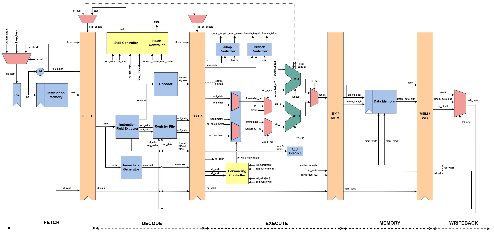

# 5-Stage Pipelined RISC-V Core | RV32IM

A 32-bit **RV32IM** processor implemented in Verilog with a classic **5-stage in-order pipeline**.

This project was built primarily to **learn** RISC-V processor architecture by implementing the datapath, control logic, hazards, forwarding, multi-cycle execution, and FPGA integration stage by stage.

The processor has been simulated with directed and **application-level test programs** and successfully synthesized for a **Xilinx Artix-7** FPGA at **100 MHz**.

**Simplified Block Diagram**  
*Implementation-specific control and datapath signals are omitted for clarity.*

## Pipeline Architecture

The processor follows a classic **5-stage in-order pipeline**: **IF → ID → EX → MEM → WB**, separated by the **IF/ID, ID/EX, EX/MEM, and MEM/WB** pipeline registers. The IF stage fetches the instruction and computes `PC + 4`; ID extracts instruction fields, generates immediates, reads the register file, and produces control signals; EX performs ALU operations, branch/jump resolution, forwarding, and RV32M execution; MEM handles load/store accesses; and WB selects the final result and writes it back to the register file.

Each pipeline register carries a **valid bit** alongside the instruction data and control signals. A cleared valid bit represents a bubble. Instruction flushing is handled by clearing the valid bit in the **IF/ID** and **ID/EX** pipeline registers, allowing stale pipeline contents to remain physically present without causing architectural side effects. Valid bits qualify actions such as register writes, memory writes, and control-flow redirects, and are used as part of the hazard handling for load-use stalls, branch/jump flushes, and multi-cycle RV32M execution.

Pipeline registers sample new data only when their **enable** signal is asserted; otherwise, they retain their previous contents. During a flush, the associated pipeline entry is marked invalid rather than requiring all stored data to be cleared. This stale payload may continue propagating through later stages with its valid bit cleared, ensuring that it cannot modify the register file, memory, or control flow.

## Hazard Handling

The processor handles the following pipeline hazards:

- **Data forwarding** from MEM and WB to EX that resolves RAW dependencies without stalling
- **Load-use stalling** when an instruction depends on load data that is not yet available
- **Branch/JAL/JALR redirect flushing** to invalidate younger wrong-path instructions
- **Multi-cycle RV32M stalling** while multiply/divide operations occupy the EX stage

The processor handles most **RAW data hazards** using a forwarding network in the EX stage. Source register addresses in EX are compared against destination register addresses in MEM and WB, with **MEM given priority over WB** when both match. ALU results and `PC + 4` can be forwarded directly from MEM, while the final writeback value can be forwarded from WB. The forwarded operands are shared by the ALU, RV32M unit ,branch comparator, JALR address calculation and store-data path. Loads are not forwarded from MEM because their memory data is not yet available.

A **load-use hazard** is detected when a valid load in EX writes a non-zero destination register required by the instruction currently in ID. In this case, the PC and IF/ID register are held while a bubble is injected into ID/EX. The load is allowed to continue through the pipeline, after which its result becomes available through WB forwarding. The register file also provides same-cycle WB-to-ID bypassing for values being written back while a dependent instruction is being decoded.

**Control hazards** are resolved in the EX stage. When a valid branch, JAL, or JALR redirects execution, the PC is updated to the target and the younger instructions in IF/ID and ID/EX are flushed by clearing their valid bits. Since branch redirects and architectural side effects are qualified by the pipeline valid state, stale wrong-path instruction payloads cannot redirect execution or modify processor state.

RV32M instructions introduce a separate **multi-cycle EX stall**. While the iterative multiply/divide unit is busy, the PC, IF/ID, and ID/EX stages are held so the M instruction remains in EX, while older instructions already present in MEM and WB are allowed to drain. Advancement of another valid instruction into EX/MEM is suppressed until the M operation completes, after which normal pipeline execution and forwarding resume.

## Supported ISA

The core implements the **RV32IM** instruction set, consisting of the 32-bit base integer ISA (**RV32I**) together with the integer multiplication and division extension (**RV32M**).

### Supported ISA

| ISA | Category | Instructions |
|---|---|---|
| **RV32I** | Integer Arithmetic | `ADD`, `SUB`, `ADDI` |
|  | Logical | `AND`, `OR`, `XOR`, `ANDI`, `ORI`, `XORI` |
|  | Shifts | `SLL`, `SRL`, `SRA`, `SLLI`, `SRLI`, `SRAI` |
|  | Comparisons | `SLT`, `SLTU`, `SLTI`, `SLTIU` |
|  | Upper Immediate | `LUI`, `AUIPC` |
|  | Branches | `BEQ`, `BNE`, `BLT`, `BGE`, `BLTU`, `BGEU` |
|  | Jumps | `JAL`, `JALR` |
|  | Loads | `LB`, `LH`, `LW`, `LBU`, `LHU` |
|  | Stores | `SB`, `SH`, `SW` |
| **RV32M** | Multiply | `MUL`, `MULH`, `MULHSU`, `MULHU` |
|  | Divide | `DIV`, `DIVU` |
|  | Remainder | `REM`, `REMU` |

A total of 45 instructions.
(`FENCE`, `ECALL`, and `EBREAK` are **not supported**)

All eight instructions from the RISC-V **M extension** are supported:
RV32M operations are executed using a shared **iterative multi-cycle execution unit** in the EX stage rather than single-cycle combinational multipliers or dividers.

## Memory System

The core uses separate **instruction and data memories**. Each organized as **1024 × 32-bit words** (4kB). Instruction fetches and data-memory reads are asynchronous to match the current 5-stage datapath, while data-memory writes occur synchronously on the clock edge. The memories are intentionally inferred as **distributed LUTRAM** on the FPGA rather than Block RAM.

The data memory supports byte, halfword, and word accesses. The lower address bits select the required byte or halfword within a word, with sign or zero extension applied for load instructions.

| Operation | Supported Instructions |
|---|---|
| Byte Load | `LB`, `LBU` |
| Halfword Load | `LH`, `LHU` |
| Word Load | `LW` |
| Byte Store | `SB` |
| Halfword Store | `SH` |
| Word Store | `SW` |

For synthesis and implementation, the instruction memory should always be initialized using a valid `program.mem` file. The file should contain at least a small sequence of valid instructions, with all remaining unused locations filled with `NOP` instructions (`ADDI x0, x0, 0`).

If the instruction memory is left uninitialized or effectively constant, Vivado may determine that large parts of the processor have no observable effect and optimize them away during synthesis. This can result in missing modules in the implemented netlist, unrealistically high timing slack, and utilization figures that no longer represent the full processor.

## FPGA Implementation
Results as on 23/09/26

The core was synthesized, placed, and routed using **Vivado 2026.1** for a **Xilinx Artix-7 XC7A100T-CSG324-1** device. The design is constrained to a **100 MHz** system clock with a 10 ns period and successfully meets all internal setup, hold, and pulse-width timing requirements after routing.

### Resource Utilization

| Resource | Used | Available | Utilization |
|---|---:|---:|---:|
| Slice LUTs | 2351 | 63400 | 3.71% |
| LUTs as Logic | 1839 | 63400 | 2.90% |
| LUTs as Distributed RAM | 512 | 19000 | 2.69% |
| Slice Registers | 1096 | 126800 | 0.86% |
| Slices | 787 | 15850 | 4.97% |
| F7 Muxes | 283 | 31700 | 0.89% |
| F8 Muxes | 128 | 15850 | 0.81% |
| Block RAM | 0 | 135 | 0.00% |
| DSPs | 0 | 240 | 0.00% |
| BUFGCTRL | 1 | 32 | 3.13% |

The processor intentionally uses **distributed LUTRAM** for its memories, with 512 LUTs inferred as distributed RAM. No Block RAM or DSP resources are used; the RV32M multiply/divide unit is implemented entirely using FPGA logic and registers.

### Timing

| Metric | Result |
|---|---:|
| Clock Frequency | **100 MHz** |
| Clock Period | **10.000 ns** |
| Worst Setup Slack (WNS) | **+0.382 ns** |
| Total Setup Violation (TNS) | **0.000 ns** |
| Worst Hold Slack (WHS) | **+0.052 ns** |
| Total Hold Violation (THS) | **0.000 ns** |
| Worst Pulse Width Slack (WPWS) | **+3.750 ns** |
| Failing Setup Endpoints | **0** |
| Failing Hold Endpoints | **0** |

The current critical setup path begins in the **MEM/WB stage** and propagates through the forwarding/control-flow logic to the PC update path. The worst data-path delay is approximately **9.57 ns**, of which roughly **76% is routing delay** and **24% is logic delay**, indicating that placement and routing dominate the current timing limit.

The worst hold path is inside the RV32M unit and has **+0.052 ns** slack. All internal timing constraints are met. The external `raw_rst` input is intentionally marked as a false path only up to the first reset synchronizer flip-flop, while the synchronizer stages themselves remain normally timed.

### Implementation Notes

- The design uses **distributed RAM instead of BRAM** to preserve the asynchronous memory-read behavior used by the current pipeline.
- The RV32M unit uses **0 DSP blocks** and is implemented entirely in LUT/register logic.
- The asynchronous external reset is passed through a **two-flop synchronizer** before entering the processor.
- Instruction memory should be initialized with a valid `program.mem` before synthesis and implementation. Leaving the instruction memory uninitialized can allow Vivado to optimize away large portions of the processor, resulting in misleading utilization and timing results.
